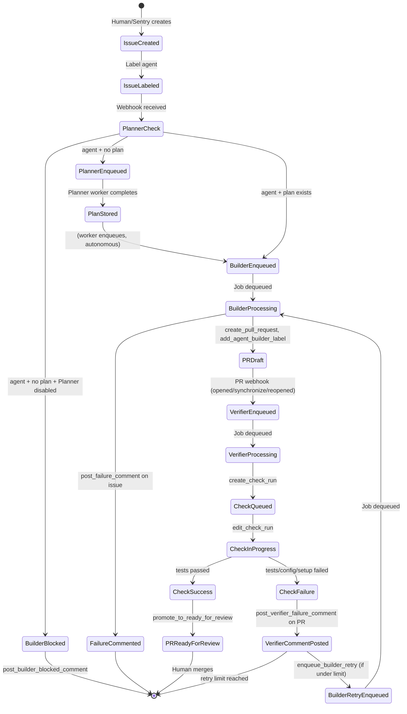

# Agent–GitHub State Diagram

State diagram of interactions between Booty agents (Builder, Verifier, Observability) and GitHub.

## Overview

## Main Flow (Issue → PR → Merge)

## Agent Responsibilities

| Agent | Trigger | GitHub API Actions |
|-------|---------|--------------------|
| **Observability** | Sentry webhook (`event_alert`) | `create_issue` with `agent` label |
| **Planner** | `issues` webhook (action=`opened`/`labeled`, label=`agent`) | Produce plan, post comment, store JSON |
| **Architect** | Plan from Planner | Define architecture (future) |
| **Builder** | Plan exists + `agent` | `clone`, `create_pull_request`, `add_to_labels`, `post_failure_comment`; requires valid Plan artifact |
| **Verifier** | `pull_request` webhook (opened/synchronize/reopened) | `create_check_run`, `edit_check_run`, `promote_to_ready_for_review`, `post_verifier_failure_comment`, enqueue Builder retry |

## Verifier Check Run States

## Failure Paths

- **Builder blocked (no plan)**: `post_builder_blocked_comment` on issue; add `agent` or await Planner
- **Builder pipeline crash**: `post_failure_comment` on issue; PR may exist in draft
- **Verifier failure**: Verifier posts `post_verifier_failure_comment` on PR; **Router** enqueues **Builder** retry (up to `MAX_VERIFIER_RETRIES`). Builder responds by fixing and pushing.
- **Self-modification disabled**: `post_self_modification_disabled_comment` on issue; job ignored
